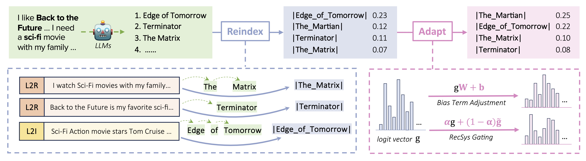

# Reindex-Then-Adapt
Implementation of WSDM'25 [Reindex-Then-Adapt: Improving Large Language Models for Conversational Recommendation](https://dl.acm.org/doi/10.1145/3701551.3703573).



## Dependencies

```shell
pip install -r requirements.txt
```

## Data

### 1. Data from Orignal Datasets

These real-world datasets are used to (1) generate data for the Reindex step; (2) adjust model weights in the Adapt step.

Download the data and move it to `data` directory.

```shell
git clone https://huggingface.co/datasets/ZhankuiHe/Reindex-Then-Adapt-Real-World-Data
mv Reindex-Then-Adapt-Real-World-Data/* data
rm -r Reindex-Then-Adapt-Real-World-Data
```

Note: the RedditV1.5 data is also included in the [link](https://huggingface.co/datasets/ZhankuiHe/Reindex-Then-Adapt-Real-World-Data).

### 2. Data from LLMs Generation

These genereated datasets are used for the Reindex step. 

Download the data and move it to `reindex_step/data` directory.
```shell
git clone https://huggingface.co/datasets/ZhankuiHe/Reindex-Then-Adapt-LLM-Generated-Data
mv Reindex-Then-Adapt-LLM-Generated-Data/* reindex_step/data
rm -r Reindex-Then-Adapt-LLM-Generated-Data
```

Note: since data for Reindex-Step are generated by Llama2, we also shared the scripts in `tools` for how we did data synthesis with the help of [exllamav2](https://github.com/turboderp-org/exllamav2).

## Experiment Steps

### Reindex Step

```shell
CUDA_VISBLE_DEVICES=0 bash reindex_step.sh
```

Move the best checkpoint (i.e., the `checkpoints` folder in `reindex_step/logs/*`) to `ckpts/best_aggregator` for our Adapt step.

### Adapt Step

```shell
for data in inspired redial redditv1.5; do
    CUDA_VISBLE_DEVICES=0 bash adapt_step_for_${data}.sh
done
```

Note: we shared our best configs in `scripts/best_*.yaml`.

## BibTeX

Please cite our paper if using this code, and feel free to contact zhh004@ucsd.edu if any questions.

```bibtex
@inproceedings{he2025rta,
author = {He, Zhankui and Xie, Zhouhang and Steck, Harald and Liang, Dawen and Jha, Rahul and Kallus, Nathan and McAuley, Julian},
title = {Reindex-Then-Adapt: Improving Large Language Models for Conversational Recommendation},
year = {2025},
isbn = {9798400713293},
publisher = {Association for Computing Machinery},
address = {New York, NY, USA},
url = {https://doi.org/10.1145/3701551.3703573},
booktitle = {Proceedings of the Eighteenth ACM International Conference on Web Search and Data Mining},
pages = {866–875}
}
```